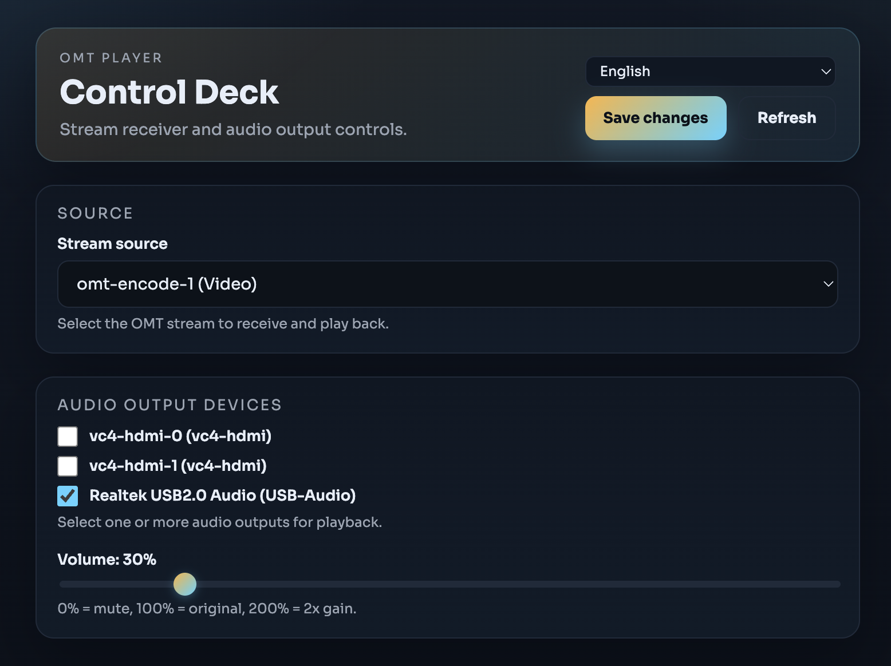

[English](README.md)

# OMT Decoder

Raspberry Pi용 저지연 OMT 스트림 수신기/플레이어. **Rust**로 재작성하여 최대 성능을 달성합니다.

## 왜 Rust인가?

기존 C#/.NET 구현은 200MB+ .NET 런타임이 필요하고, GC 일시정지와 managed↔native 마샬링 오버헤드가 있었습니다. Rust 포팅으로 이를 모두 제거했습니다:

| | C# (.NET 8 AOT) | Rust |
|---|---|---|
| **런타임 의존성** | .NET 8 (~200MB) | 없음 (정적 바이너리) |
| **바이너리 크기** | ~30MB + 런타임 | ~5MB 단독 실행 |
| **VMX 디코딩** | 관리 배열 + P/Invoke 마샬링 | 제로카피, 사전 할당 버퍼 |
| **오디오 경로** | GC 관리 버퍼, 풀 할당 | ALSA FFI 직접 호출, 할당 부담 없음 |
| **프레임 전달** | 비동기 소켓 + 프레임 풀 + GC | 블로킹 TCP read, 제로카피 파싱 |
| **메모리** | ~150MB RSS | ~70MB RSS |
| **비디오 지연** | ~20-30ms | ~18-30ms (디코딩 7-12ms + vsync) |

### 아키텍처

```
Player 스레드:  TCP read → 오디오 writei → 비디오 채널
Video 스레드:   채널 수신 → VMX 디코드 → DRM page-flip
Tokio 런타임:   웹 서버 + mDNS 디스커버리 (비간섭)
```

- **GC 없음, 런타임 없음** — 결정적 레이턴시, 일시정지 스파이크 없음
- **제로카피 프레임 파싱** — TCP 버퍼에서 `BytesMut` 직접 분리
- **사전 할당 디코드 버퍼** — VMX가 재사용 버퍼에 디코딩, 프레임별 할당 없음
- **ALSA FFI 직접 호출** — TCP read 스레드에서 `snd_pcm_writei` 호출, C#의 P/Invoke 경로와 동일
- **DRM page-flip** — 트리플 버퍼링 vsync 출력 + 전용 이벤트 스레드

### 웹 UI



다크 테마 웹 컨트롤 패널 (omt-encoder 스타일):
- mDNS 자동 탐색 소스 선택
- 영상 품질 선택 (낮음 / 보통 / 높음) — 인코더에 품질 힌트 전송, 런타임 변경 가능
- 오디오 출력 장치 선택
- 볼륨 슬라이더 (0-200%)
- 다국어 지원 (영어, 한국어, 일본어, 스페인어)
- 토스트 알림

### USB 오디오 DAC 지원

Raspberry Pi에 연결된 USB DAC로 오디오를 출력할 수 있습니다. 웹 UI에서 사용 가능한 ALSA 출력 장치 목록이 표시되며, USB DAC를 선택하고 HDMI 출력을 해제하면 됩니다. 외장 DAC, 헤드폰 앰프, USB 입력 파워드 스피커 등을 통한 고품질 오디오 재생이 가능합니다.

### 적응형 품질

플레이어가 인코더에 `<OMTSettings Quality="..." />`를 전송하여 비디오 비트레이트를 조정합니다:

| 품질 | 예상 비트레이트 (1080p30) | 용도 |
|------|--------------------------|------|
| **낮음** | ~30-40 Mbps | WiFi, 혼잡한 네트워크 |
| **보통** | ~60-80 Mbps | 기본값, 균형 |
| **높음** | ~100-120 Mbps | 유선 LAN, 최고 품질 |

웹 UI에서 재연결 없이 런타임으로 변경할 수 있습니다.

## Raspberry Pi 설치

### 1. 콘솔 부팅 설정

`omtplayer`는 DRM으로 직접 출력합니다. 데스크톱 모드를 비활성화해야 합니다.

```bash
sudo raspi-config
```

`1 System Options` → `S5 Boot` → `B1 Console Text console` 선택

### 2. 클론 및 빌드

```bash
git clone https://github.com/stephen-kim/omt-decoder.git
cd omt-decoder
chmod +x build_and_install_service.sh
./build_and_install_service.sh
```

스크립트가 Rust 툴체인 + 의존성 설치, 빌드, `/opt/omtplayer` 배포, systemd 서비스 등록까지 처리합니다.

### 3. 상태 확인

```bash
sudo systemctl status omtplayer
```

웹 UI: `http://<pi-ip>:8080/`

## 라이센스

MIT License. [LICENSE](LICENSE) 참조.
